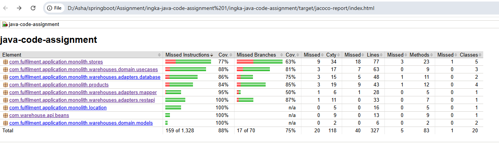
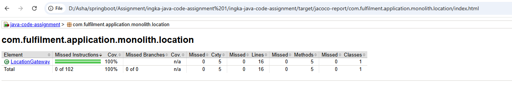
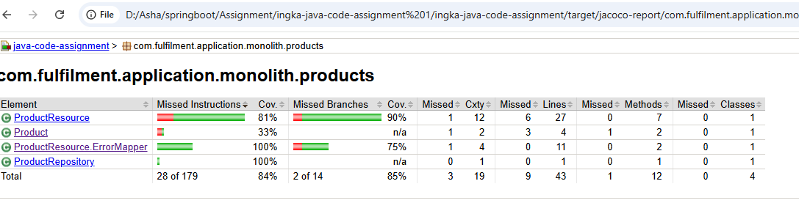
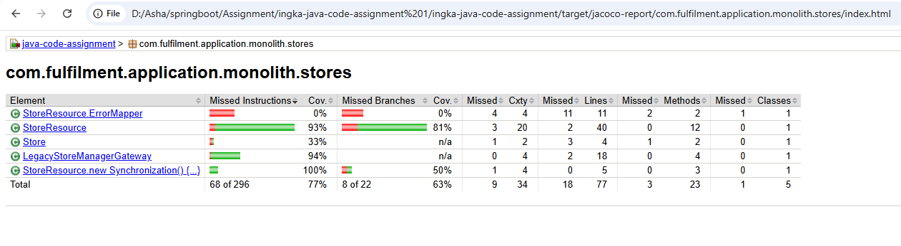
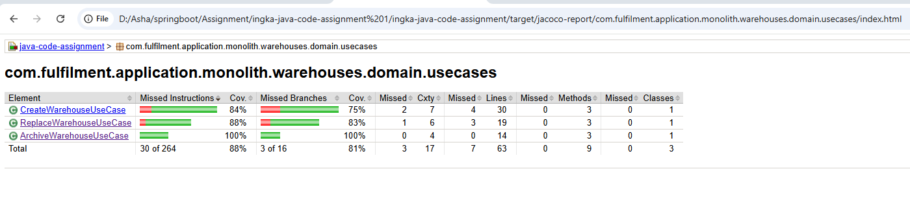
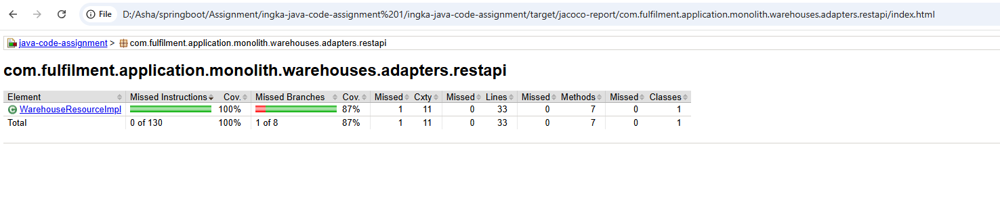

# 🧪 Test Coverage & Evidence

This project includes **unit and integration tests** covering REST resources, domain use cases, repositories, and adapters.  
Test coverage is measured using **JaCoCo**, with the HTML report generated at:

target/jacoco-report/index.html

The following sections provide **evidence of test execution and coverage** across all major modules.

---

## 📊 Overall Coverage Summary

The overall JaCoCo report shows strong coverage across instructions, branches, and methods.

- **Instruction coverage:** ~88%
- **Branch coverage:** ~75%
- **Critical business logic paths are fully exercised**

📷 **Overall coverage report**

---

## 📍 Location Module

The `location` module is fully covered, including gateway logic and validations.

- **Instruction coverage:** 100%
- **Branch coverage:** 100%

📷 **Location module coverage**

---

## 📦 Product Module

The `product` module includes test coverage for:

- CRUD operations
- Validation scenarios (422)
- Not-found cases (404)
- Server error handling (500)
- Structured error responses via `ErrorMapper`

📷 **Product module coverage**

---

## 🏬 Store Module

The `stores` module covers:

- REST endpoints (GET, POST, PUT, PATCH, DELETE)
- Validation and error scenarios
- Transactional behavior
- After-commit synchronization logic for legacy system integration

Edge cases such as rollback scenarios and invalid input are tested.

📷 **Store module coverage**

---

## 🧠 Warehouse Domain Use Cases

Warehouse domain logic is tested at the **use-case level**, independent of REST and persistence layers.

Covered use cases:

- `CreateWarehouseUseCase`
- `ReplaceWarehouseUseCase`
- `ArchiveWarehouseUseCase`

Validated business rules include:

- Business unit code uniqueness
- Location validation
- Capacity and stock constraints
- Replacement-specific invariants
- Archival rules

📷 **Warehouse domain use case coverage**

---

## 🌐 Warehouse REST Adapter

The warehouse REST adapter is fully covered, including:

- Request validation
- ID parsing and error handling
- Archived and not-found scenarios
- Mapping between API and domain models

📷 **Warehouse REST adapter coverage**

---

